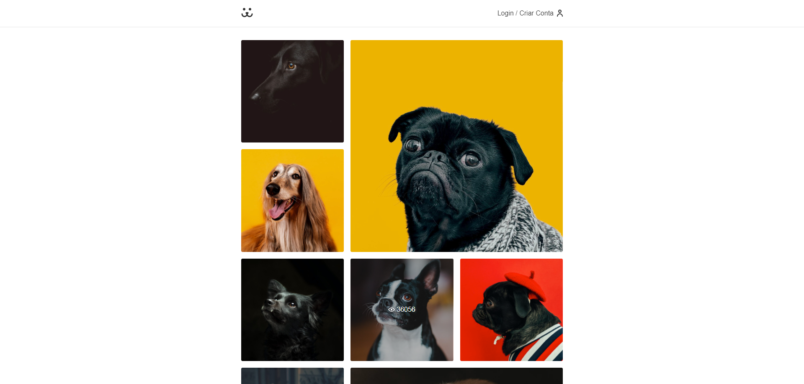

  

# 🐶 Social Dogs
Projeto de um aplicativo tipo rede-social, para cachorros, usando a API do curso Origamid para obter os dados.

- Veja o projeto: [Live Preview](https://victtor-social-dogs.vercel.app/)

## ⚙️ Funcionalidades

- [x] Aplicação totalmente responsiva;
- [x] Possui sistema de login, com perfil completo e com a funcionalidade de "perdeu a senha";
- [x] Pode postar e deletar as suas fotos, podendo comentar nas mesmas, e gera um gráfico com as estatísticas das mesmas;
- [x] Usa uma API para buscar os dados da aplicação;
- [x] Tem um "skeleton" enquanto espera as requisições serem carregadas;
- [x] Segue as boas práticas e normas padrões de segurança;

## 🚀 Tecnologias

- [HTML](https://www.w3schools.com/html/)
- [CSS](https://developer.mozilla.org/pt-BR/docs/Web/CSS)
- [JavaScript](https://developer.mozilla.org/pt-BR/docs/Web/JavaScript)
- [React](https://react.dev/)

## 📝 Considerações

 Com esse projeto aprendi e pude praticar bastante sobre React.
